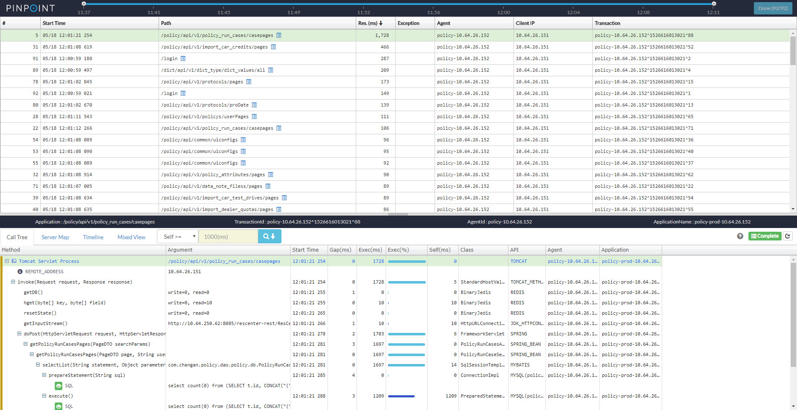
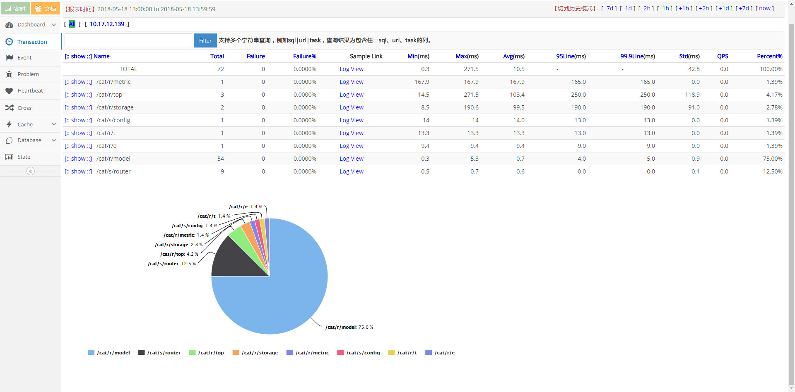
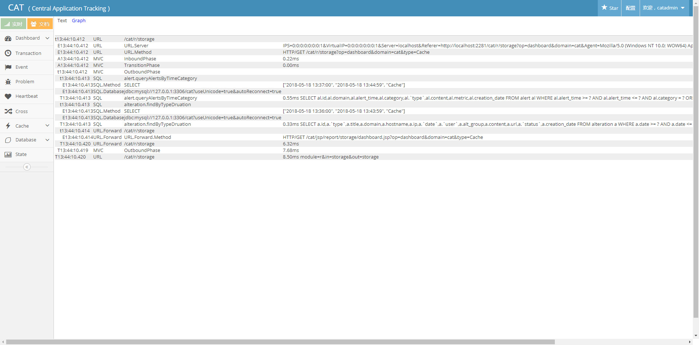

## 大众点评CAT

### pingpoint对比cat

pingpoint
pingpoint 以时间点记录明细

cat
cat 统计了响应时间、调用百分比等，明细只有最后一次调用

cat 统计了访问趋势

### 总结
cat做了一些统计，类似访问占比，响应时间，每秒查询率等。
埋点侵入性太强。插件较少，目前支持dubbo,es,mybatis,spring等。
提供了agent方式 但是没有使用成功。。