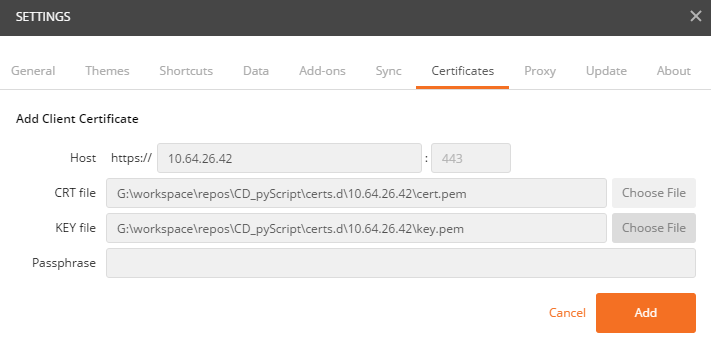
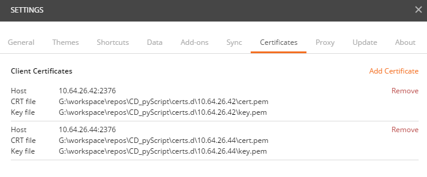
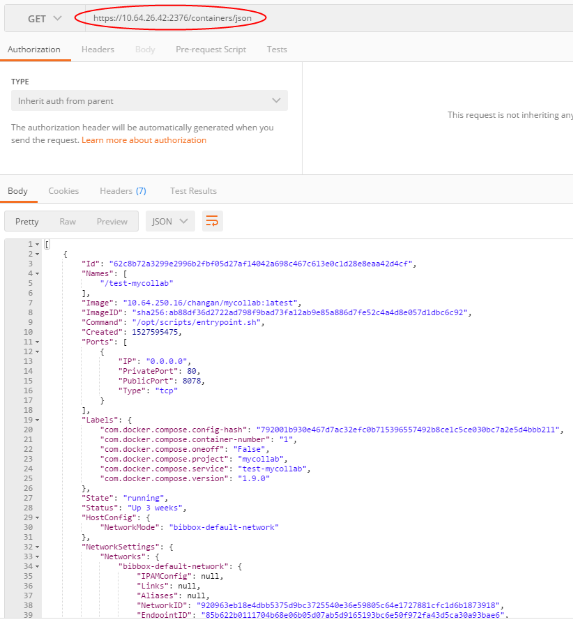
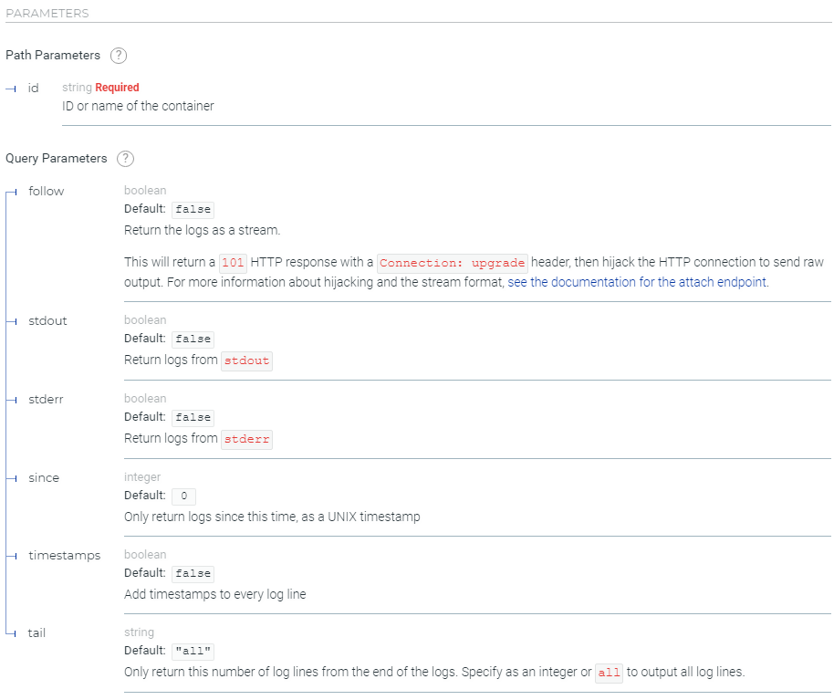
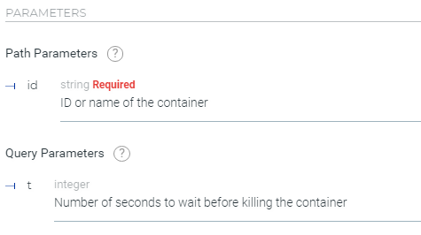

# DOCKER API调研

> 调研使用[docker api](https://docs.docker.com/engine/api/v1.32/#)，通过http请求获取容器列表，容器日志等信息并实现容器启停、创建、删除等

## docker api的使用

- 由于docker守护进程接口使用了tls进行保护，所以要在请求发出前提供受信证书。这里使用postman尝试调用docker api，就要先添加配置认证文件。
  
  

- 配置好tls认证文件之后，就可以参照docker api文档进行调用，下面以查看所有容器为例
  
  - _接口文档_
    
    
    （可以看到，接口还提供了一些参数可供使用）

  - _请求及响应_
    
    

## 可能使用到的api

- __[获取容器日志](https://docs.docker.com/engine/api/v1.32/#operation/ContainerLogs)__
  - 接口： `GET /containers/{id}/logs`
  - 接口参数
    
    
    (接口中的id即容器id，也可以是容器名。需要注意的是请求时，一定要设置stdout和stderr至少一个为true，才会有内容输出)

- __[重启容器](https://docs.docker.com/engine/api/v1.32/#operation/ContainerRestart)__
  - 接口： `POST /containers/{id}/restart`
  - 接口参数
    
    

- __[创建容器](https://docs.docker.com/engine/api/v1.32/#operation/ContainerCreate)__
  - 接口： `POST /containers/create`
  - 接口参数示例：
    
    ```json
    {
        "Hostname": "",
        "Domainname": "",
        "User": "",
        "AttachStdin": false,
        "AttachStdout": true,
        "AttachStderr": true,
        "Tty": false,
        "OpenStdin": false,
        "StdinOnce": false,
        "Env": [
            "FOO=bar",
            "BAZ=quux"
        ],
        "Cmd": [
            "date"
        ],
        "Entrypoint": "",
        "Image": "ubuntu",
        "Labels": {
            "com.example.vendor": "Acme",
            "com.example.license": "GPL",
            "com.example.version": "1.0"
        },
        "Volumes": {
            "/volumes/data": {}
        },
        "WorkingDir": "",
        "NetworkDisabled": false,
        "MacAddress": "12:34:56:78:9a:bc",
        "ExposedPorts": {
            "22/tcp": {}
        },
        "StopSignal": "SIGTERM",
        "StopTimeout": 10,
        "HostConfig": {
            "Binds": ["/tmp:/tmp"],
            "Links": ["redis3:redis"],
            "Memory": 0,
            "MemorySwap": 0,
            "MemoryReservation": 0,
            "KernelMemory": 0,
            "NanoCPUs": 500000,
            "CpuPercent": 80,
            "CpuShares": 512,
            "CpuPeriod": 100000,
            "CpuRealtimePeriod": 1000000,
            "CpuRealtimeRuntime": 10000,
            "CpuQuota": 50000,
            "CpusetCpus": "0,1",
            "CpusetMems": "0,1",
            "MaximumIOps": 0,
            "MaximumIOBps": 0,
            "BlkioWeight": 300,
            "BlkioWeightDevice": [
                {}
            ],
            "BlkioDeviceReadBps": [
                {}
            ],
            "BlkioDeviceReadIOps": [
                {}
            ],
            "BlkioDeviceWriteBps": [
                {}
            ],
            "BlkioDeviceWriteIOps": [
                {}
            ],
            "MemorySwappiness": 60,
            "OomKillDisable": false,
            "OomScoreAdj": 500,
            "PidMode": "",
            "PidsLimit": -1,
            "PortBindings": {
            "22/tcp": [
                {
                    "HostPort": "11022"
                }
            ]
            },
            "PublishAllPorts": false,
            "Privileged": false,
            "ReadonlyRootfs": false,
            "Dns": [
                "8.8.8.8"
            ],
            "DnsOptions": [
                ""
            ],
            "DnsSearch": [
                ""
            ],
            "VolumesFrom": [
                "parent",
                "other:ro"
            ],
            "CapAdd": [
                "NET_ADMIN"
            ],
            "CapDrop": [
                "MKNOD"
            ],
            "GroupAdd": [
                "newgroup"
            ],
            "RestartPolicy": {
                "Name": "",
                "MaximumRetryCount": 0
            },
            "AutoRemove": true,
            "NetworkMode": "bridge",
            "Devices": [],
            "Ulimits": [
                {}
            ],
            "LogConfig": {
                "Type": "json-file",
                "Config": {}
            },
            "SecurityOpt": [],
            "StorageOpt": {},
            "CgroupParent": "",
            "VolumeDriver": "",
            "ShmSize": 67108864
        },
        "NetworkingConfig": {
            "EndpointsConfig": {
                "isolated_nw": {
                    "IPAMConfig": {
                    "IPv4Address": "172.20.30.33",
                    "IPv6Address": "2001:db8:abcd::3033",
                    "LinkLocalIPs": [
                        "169.254.34.68",
                        "fe80::3468"
                    ]
                    },
                    "Links": [
                        "container_1",
                        "container_2"
                    ],
                    "Aliases": [
                        "server_x",
                        "server_y"
                    ]
                }
            }
        }
    }
    ```