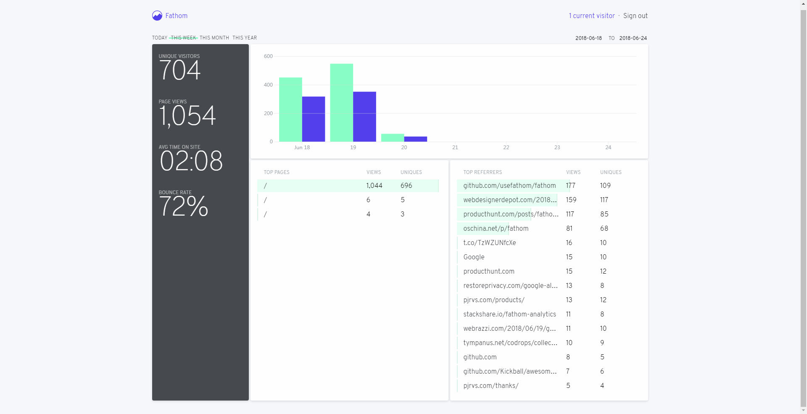

# 网页分析开源工具Fathom调研

## 系统功能

- 监控网站访问信息
- 提供简单图表展示（包括访客人数，页面浏览数，访客平均在线时间，网站跳出率，网站访问趋势等）

## 界面

## 优点

- 提供容器方式部署
- 界面操作明确，内容直接
- 强调数据隐私
- 项目最近更新较频繁

## 缺点

- 信息收集采用页面埋点方式
- 功能较少，分析维度有限
- 项目本身维护有阶段性特点（中间有较长时间未更新），用于生产环境有风险
- 中英文资料少，没有案例参考
- 相比于matomo(piwik更名为matomo)，没有分项目统计的功能

## 对于平台

- 可以快速部署，对服务页面访问有一个初步统计

## 总结

算是处于初期的项目，界面简单，部署简单，作者强调网站统计信息的隐私，但这个只针对于像google 分析工具这种会向上回传的分析平台，而开源的工具，例如matomo 数据也是只存储在服务器本地。

issue中可以看到有人很看好这个项目，功能内容有完善的空间，可以继续观察一段时间

