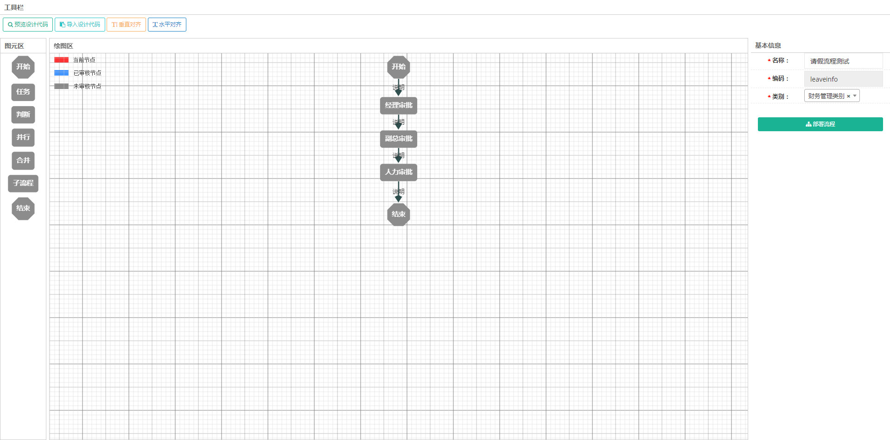
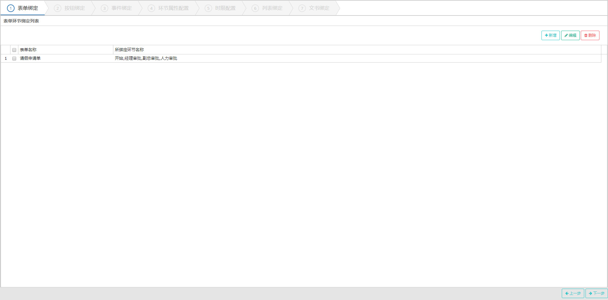
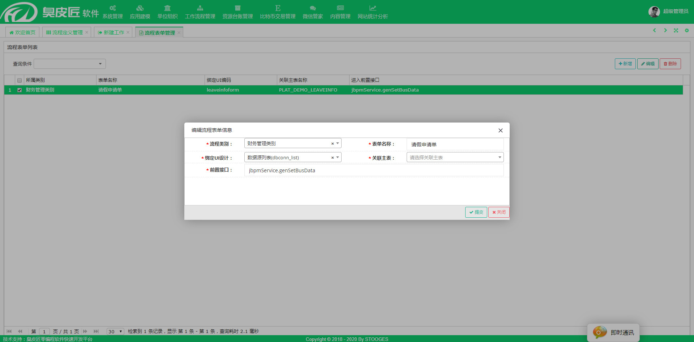
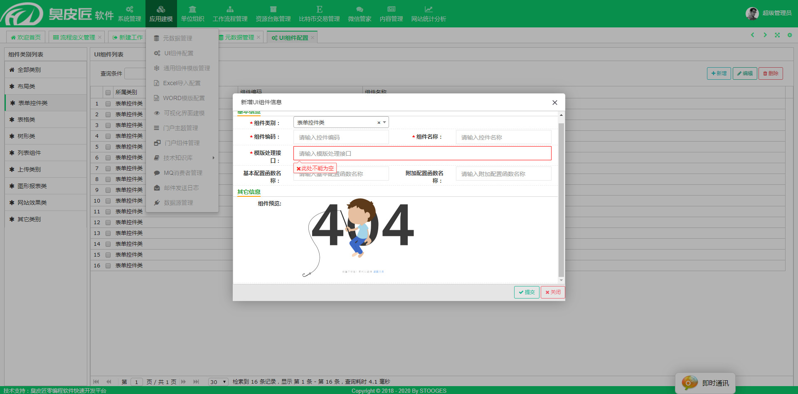
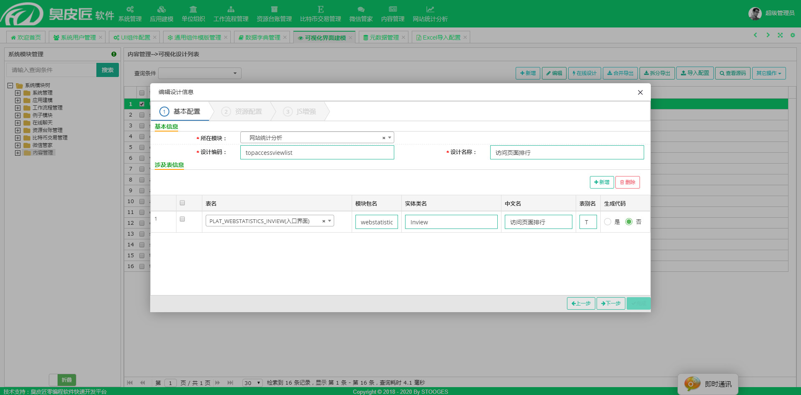
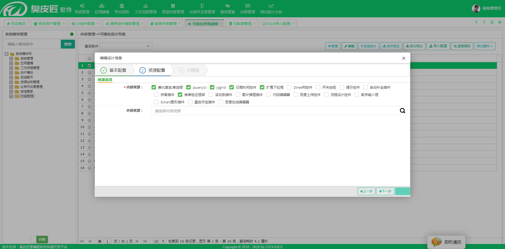

# 臭皮匠

## 后台技术

1. spring4
2. jdbcTemplate
3. jbpm6
4. shiro
5. ehcache
6. druid
7. freemarker
8. websocket

## 前台技术

1. bootstrap3.5
2. jquery2
3. ueditor
4. jqgrid
5. layer
6. nice-validator
7. webuploader

### 流程

**流程定义**

**流程环节配置**

- 表单绑定
- 按钮绑定
- 事件绑定
- 环节属性配置（字段权限、审批人、单人、多人等）
- 时限配置
- 列表绑定
- 文书绑定（？）

**流程表单自定义**

绑定UI页面 绑定数据库

### UI配置
配置生成UI代码用接口

### 可视化界面配置
配置所用表

2018-04-27_100317.jpg

配置页面资源

