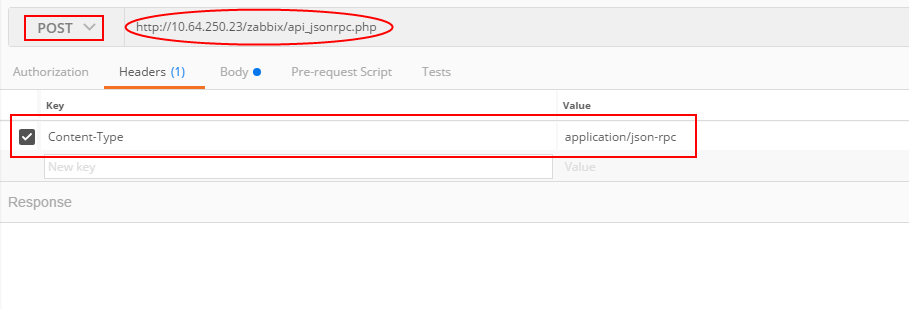
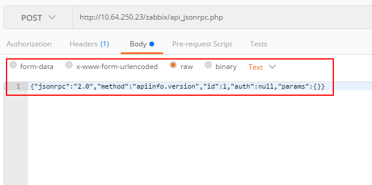
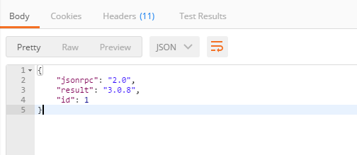

# ZABBIX API调研

> 为了在远程监控系统中查看监控状态，需要使用到zabbix提供的api。主要调研内容为：api接口调用方式、需要使用哪些api接口。

## api 概述

Zabbix API是基于Web的API，作为Web前端的一部分提供。它使用[JSON-RPC 2.0协议](https://www.jsonrpc.org/specification):

- 该API包含一组独立的方法
- 客户端和API之间的请求和响应使用JSON格式进行编码

Zabbix API包含许多方法，这些方法都名义上分组为单组的API。每个方法执行一个特定任务。例如，方法 host.create 隶属于 host 这个API ，用于创建新主机。
```note
大多数API至少包含四种方法： get， create， update 和 delete ，分别是检索，创建，更新和删除数据，但是某些API提供一套完全不同的一组方法。
```

## 接口调用方式

 向位于前端目录中的文件 api_jsonrpc.php 发送HTTP POST请求。例如，Zabbix前端地址为http://10.64.250.23/zabbix， 那么调用 apiinfo.version 方法的请求如下：
 ```
 POST http://10.64.250.23/zabbix/api_jsonrpc.php HTTP/1.1
Content-Type: application/json-rpc

{"jsonrpc":"2.0","method":"apiinfo.version","id":1,"auth":null,"params":{}}
 ```

 __使用postman请求示例：__

 _设置http请求方法、url、header_
 

_设置http请求body_
 

 _收到请求：_
 

 __小结：__

 大多数[api接口](https://www.zabbix.com/documentation/3.0/manual/api)请求都类似刚才的示例,需要更改的在http请求的json内容（主要是method、auth 及params）

 ## 可能使用的api接口

- __[user.login](https://www.zabbix.com/documentation/3.0/manual/api/reference/user/login)方法:__

在访问Zabbix中的任何数据之前，都需要登录并获取身份验证令牌。请求json如下
```json
{
    "jsonrpc": "2.0",
    "method": "user.login",
    "params": {
        "user": "admin",
        "password": "zabbix"
    },
    "id": 1,
    "auth": null
}
```
请求成功时，API返回的响应将包含用户身份验证令牌：
```json
{
    "jsonrpc": "2.0",
    "result": "0424bd59b807674191e7d77572075f33",
    "id": 1
}
```

- __[host.get](https://www.zabbix.com/documentation/3.0/manual/api/reference/host/get)方法：__

返回选择的主机，例如检索名为“zabbix server”和“Linux server”的host

```json
{
    "jsonrpc": "2.0",
    "method": "host.get",
    "params": {
        "filter": {
            "host": [
                "Zabbix server",
                "Linux server"
            ]
        }
    },
    "auth": "038e1d7b1735c6a5436ee9eae095879e",
    "id": 1
}
```
返回响应：
```json
{
    "jsonrpc": "2.0",
    "result": [
        {
            "maintenances": [],
            "hostid": "10160",
            "proxy_hostid": "0",
            "host": "Zabbix server",
            "status": "0",
            "disable_until": "0",
            "error": "",
            "available": "0",
            "errors_from": "0",
            "lastaccess": "0",
            "ipmi_authtype": "-1",
            "ipmi_privilege": "2",
            "ipmi_username": "",
            "ipmi_password": "",
            "ipmi_disable_until": "0",
            "ipmi_available": "0",
            "snmp_disable_until": "0",
            "snmp_available": "0",
            "maintenanceid": "0",
            "maintenance_status": "0",
            "maintenance_type": "0",
            "maintenance_from": "0",
            "ipmi_errors_from": "0",
            "snmp_errors_from": "0",
            "ipmi_error": "",
            "snmp_error": "",
            "jmx_disable_until": "0",
            "jmx_available": "0",
            "jmx_errors_from": "0",
            "jmx_error": "",
            "name": "Zabbix server",
            "description": "The Zabbix monitoring server.",
            "tls_connect": "1",
            "tls_accept": "1",
            "tls_issuer": "",
            "tls_subject": "",
            "tls_psk_identity": "",
            "tls_psk": ""
        },
        {
            "maintenances": [],
            "hostid": "10167",
            "proxy_hostid": "0",
            "host": "Linux server",
            "status": "0",
            "disable_until": "0",
            "error": "",
            "available": "0",
            "errors_from": "0",
            "lastaccess": "0",
            "ipmi_authtype": "-1",
            "ipmi_privilege": "2",
            "ipmi_username": "",
            "ipmi_password": "",
            "ipmi_disable_until": "0",
            "ipmi_available": "0",
            "snmp_disable_until": "0",
            "snmp_available": "0",
            "maintenanceid": "0",
            "maintenance_status": "0",
            "maintenance_type": "0",
            "maintenance_from": "0",
            "ipmi_errors_from": "0",
            "snmp_errors_from": "0",
            "ipmi_error": "",
            "snmp_error": "",
            "jmx_disable_until": "0",
            "jmx_available": "0",
            "jmx_errors_from": "0",
            "jmx_error": "",
            "name": "Linux server",
            "description": "",
            "tls_connect": "1",
            "tls_accept": "1",
            "tls_issuer": "",
            "tls_subject": "",
            "tls_psk_identity": "",
            "tls_psk": ""
        }
    ],
    "id": 1
}
```

- __[item.get](https://www.zabbix.com/documentation/3.0/manual/api/reference/item/get)方法：__

该方法允许根据给定的参数检索监控项。

- __[history.get](https://www.zabbix.com/documentation/3.0/manual/api/reference/history/get)方法：__

该方法允许根据给定的参数检索历史数据。

## 总结

zabbix api使用方法一致，示例及参数文档详细，还要更多的可能要考虑如何展示交互