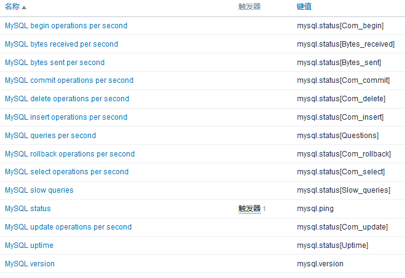
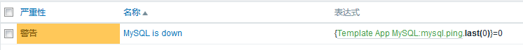

# zabbix监控中间件调研

> 主要调研mysql、redis、haproxy 的监控

## mysql
- __说明：__ mysql作为常用的数据库，zabbix本身也提供了模板，还需要获取mysql数据的脚本。在zabbix界面上看到已经有mysql加入了监控，应该可以直接找运维处为mysql加监控。
- __监控内容：__ 数据库ops（增删改查）、版本信息、是否存活等（共计14个监控项）

- __预警项：__ 数据库存活检查失败时，会发出预警（1个预警项）

- __小结：__ 预置模板基本符合需求，联系运维进行mysql监控添加

## redis
- __说明：__ zabbix 官方也提供了[redis模板](https://github.com/adubkov/zbx_redis_template),但是需要自己导入，基本上覆盖了`redis-cli info`的结果，该模板在github仓库上也提供了redis数据获取的脚本（有js和python两种），目前运维处的zabbix上也导入redis监控模板，但是还没有主机使用。
- __监控内容：__  redis使用内存、redis使用cpu、连接数、ops（total）等（共计42个监控项）
- __预警项：__ redis存活检查失败时，会发出预警（一个预警项）
- __小结：__ redis监控模板，监控项较多，已满足需求，应该也可以联系运维处添加

## haproxy
- __说明：__ haproxy的监控需要先确定要监控什么，再通过脚本去获取监控数据（可以通过获取统计页面的csv导出数据，或者通过socket获取），配置监控模板
- __监控内容：__ haproxy存活、秒吞吐量、秒连接数等（暂定）
- __预警项：__ haproxy存活检查失败时，会发出预警（一个预警项）
- __小结：__  haproxy监控没有现成的模板，先要考虑需要看到什么，再去部署监控，网上也有可以参考的监控模板